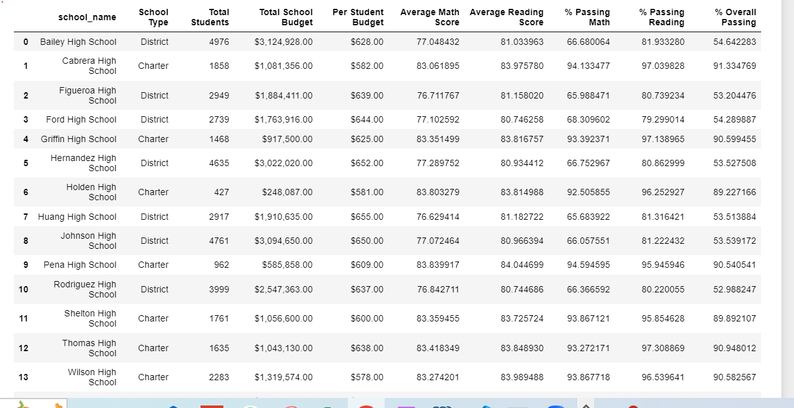

# panda-challenge
##PyCitySchools Challenge
In this Challenge I had to anaylse school and standardized test data.

The data contained students' math and reading scores as well as varios information on the schools they attend. 
Using this information I merged the data to create dataframe to display the district's key statistics

The dataframe was further sorted to extract the highest performing and lowest performing schools by overrall passing. The table below shows first five higest performing schools to be Charter schools.

 Whilst above table shows the the five lowest perfoming schools are District schools.

 

 Upon analysing schools based on their spending we find as shown in the table above that although the charter school students' perfomed better overall, there is no relation between size of budget and school performance. Bailey High School withthe highest budget of $3,124,928 has an overall passing of 54.642283%, where as whereas Holden High School with a meager budget of $248,087 has an overall passing of 89.227166%.

 

 A further analysis of the schools by their size shows medium sized schools with a population of 1000 to 2000 students scored highest overall, whilst large schools with population between 2000 to 5000 scrored the least overall as shown in the table below.
 
 
